# **Finding Lane Lines on the Road**

---
# Introduction

The purpose of this project was to develop a lane finding pipeline and apply it 
to a series of images (shown below) as well as to three video streams (two normal and
one challenge video). The report below explains my pipeline as well as reflections about issues I faced
as well as possible improvement suggestions.

 
 
 

---

# Pipeline

My pipeline consisted of the following steps:

1. Color Selection of Yellow and White Lanes 
2. Combining the above Color Selection Mask and GrayScale Image to form a Boosted Image
3. Gaussian Blur
4. Canny Edge Detection
5. Region of Interest Selection
6. Hough Transform
7. Improved DrawLines

These steps are described in detail below.
---

## Step 1 - Color Selection of Yellow and White Lane Markers

The first step consisted of identifying yellow and white lane markers by processing in the color
space. To do this, I experimented with three color spaces.

### RGB Color Space

The following are the color selection bitmaps for the RGB color space. White color is relatively easy to segment in the RGB domain (e.g. values in range [190,190,190] to [255,255,255]). Yellow is harder in the RGB space (Pure yellow in the RGB space is [255,255,0]). As shown below, white works well, but yellow does not. Also as the RGB color space is additive and does not separate luminance and chrominance, there could be issues as it gets darker. So we explore alternate color spaces.

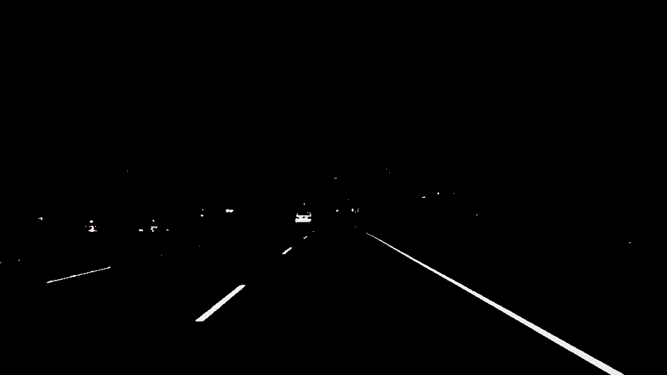 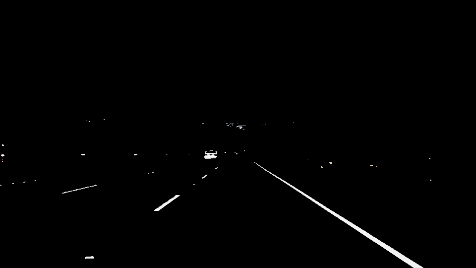
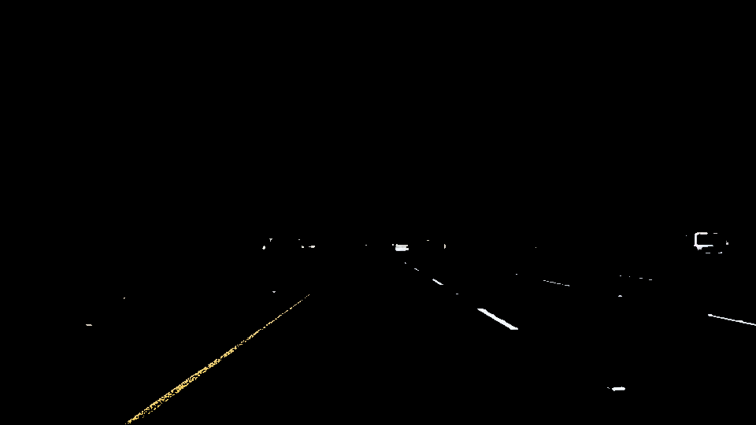 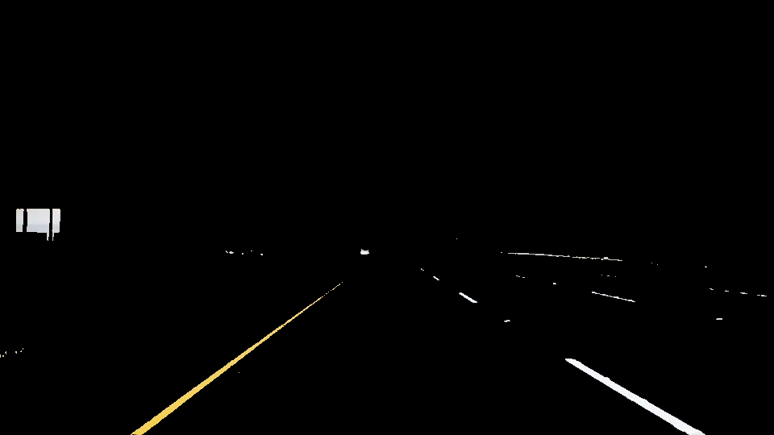
 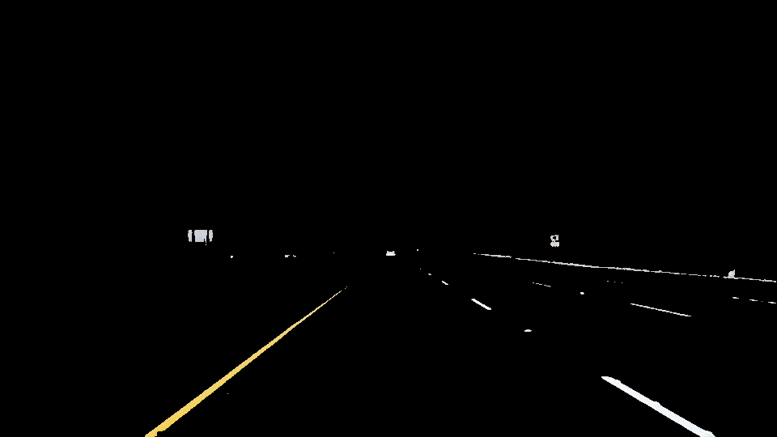

### HLS Color Space

HSL stands for _hue_, _saturation_ and _luminosity_. More details on HLS and HSV color spaces are here at [Wikipedia](https://en.wikipedia.org/wiki/HSL_and_HSV)

As shown below, both yellow and white lines are clearly visible in the HLS color space.

 
 
 

### HSV Color Space

HSV stands for _hue_, _saturation_ and _value_. Same link as above.

Unlike HSL color space, while yellow is clearly visible, white lines are not as sharp in HSV color space. So between HSL and HSV color space, we select HSL color space to filter yellow shades.  

 
 
 

### HLS Color Selection Bitmaps

Here we use color selection in the HLS color space. For yellow color, we restrict Hue to be in the range 10-40. There is no effect on luminance and we use Saturation between 100 and 255 to not deal with darker shades. For white, we make sure that luminance is high (between 200 and 255) while hue and saturation have no effect.
 
 Compared to RGB color space, HLS does a much better job selecting yellow colors. However, RGB color space is better for white. For this pipeline, we chose HSV. However choosing white in RGB and yellow in HLS could have been better. At this point we end up with the following color masks for detecting yellow and white lane markers.
 
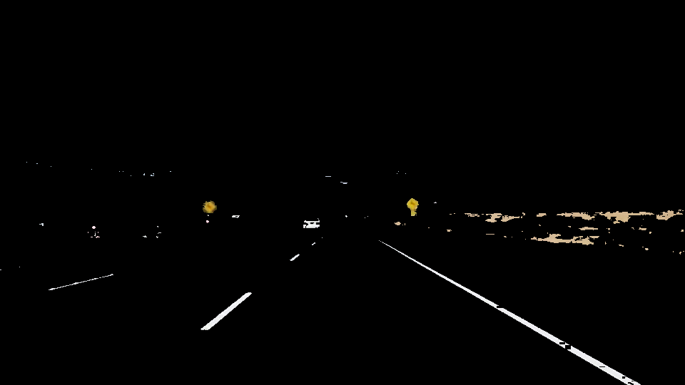 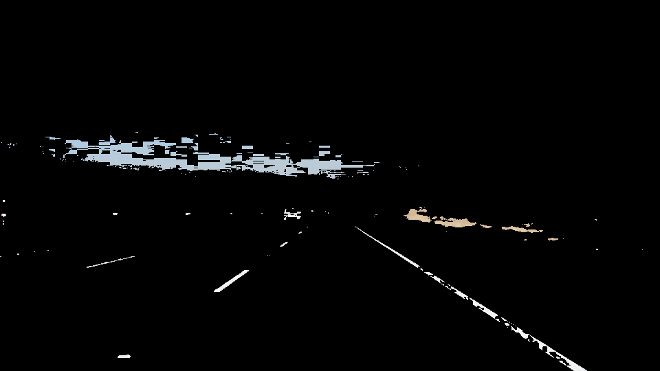
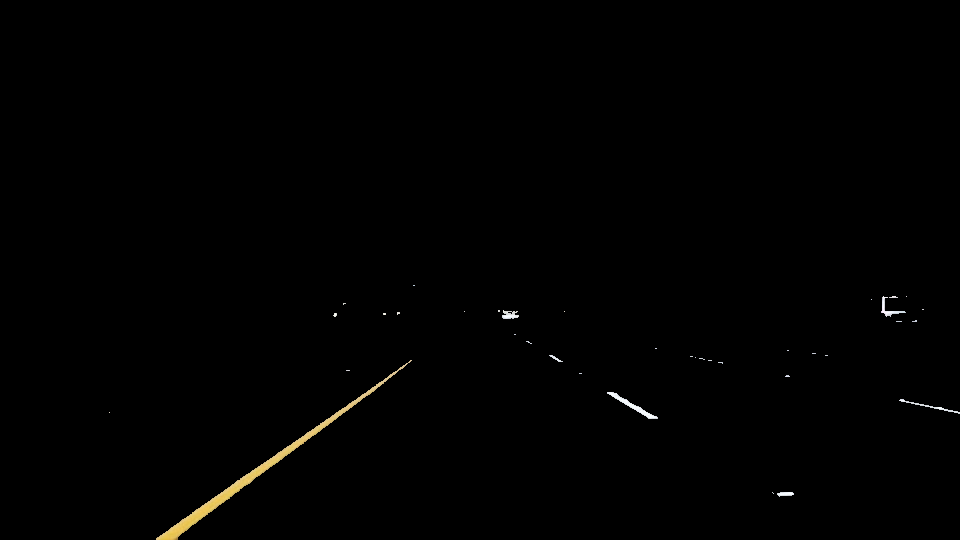 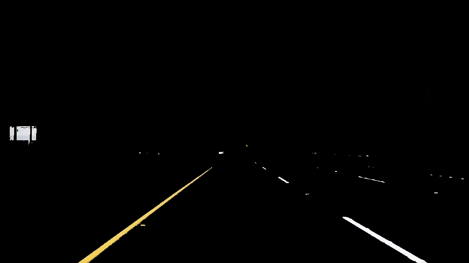
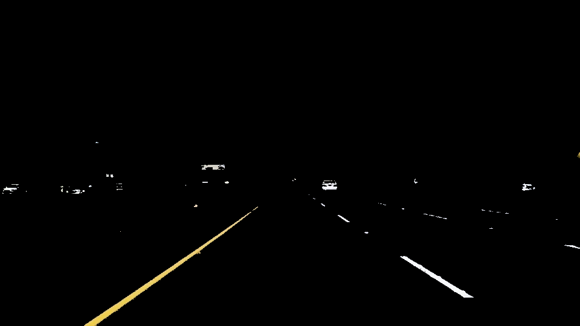 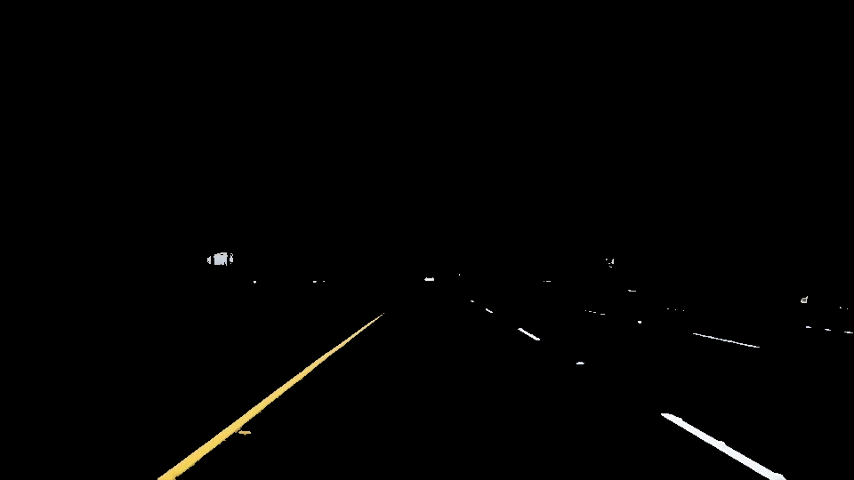

---

## Step 2 - Combining Above Mask and Grayscale image.

Rather than just use grayscale image, I combined the above lane detection mask along with the 
grayscale image to create a boosted image to send to the edge detection step. For example, the
two images below show the comparison between grayscale only (left) and the boosted grayscale (right).

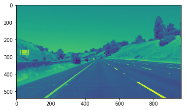 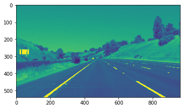

---
## Step 3 - Gaussian Blur

The next step is to run the boosted grayscale images through a Gaussian Blur filter. I have selected
a kernel size of 5. This step is carried out to reduce overall noise in the image and
to reduce detail. This should eliminate weak edges getting detected in the next step. See sample image
below after gaussian blur.

---
## Step 4 - Canny Edge Detection

The next step consisted of the Canny Edge Detection Method. I used a low threshold of 
60 and a high threshold of 150 after some experimentation.

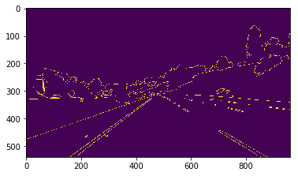

---
## Step 5 - Region of Interest Selection

The next step is to limit the edges to a well-defined area of interest. In my case, a sample image
looked as follows.
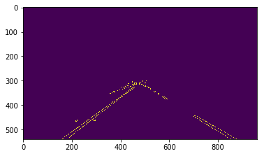

---
## Step 6 - Hough Transform

Finally, I applied the hough transform on the image above. Restricting it to 
the region of interest obviously negates other random lines being discovered
in the image. The following hough transform was using the Draw-Lines function
provided by Udacity. After some experimentation, I chose the following parameters:
Rho = 3, Theta of 1 degree, Threshold of 70, Minumum_Line_length = 80 (to disregard small lines) and 
Maximum_Line_Gap of 250 (to force lines to join together).

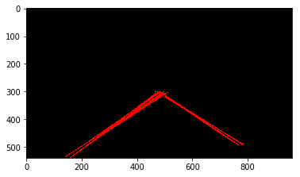 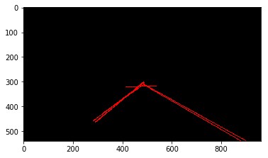

---

## Step 7 - Improved DrawLines Function

At this juncture, I worked on improving the draw lines function. The new algorithm
worked as follows:
1. For each line detected by the hough transform, find its slope. 
2. Discard lines below minimum slope: If the slope is too small (in my
case, I experimented minimum slope to be abything from 0.2 to 0.4). I finally chose 0.4 to be the minimum
slope as it performed better for the Challenge Video (see below in reflections).
3. For lines with slope bigger than minimum slope, categorize them to either left lane or
right lane based on the slope sign (positive or negative).
4. For all the lines that are part of the left hand lane, find one single line passing 
through them using the Numpy Polyfit function. Same for right hand lane.
5. Using the line coefficients (slope, intercept) selected in the above 
step, find the intercepts for the line at the boundaries defined by the
region of interest. At the bottom of the image, this touches the image boundary.
6. Use a thicker line (purely aesthetic).

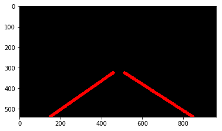 

---

# Final Outputs

The following images and videos show the final outputs after running through
the pipeline described above

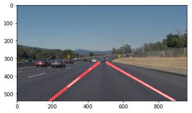 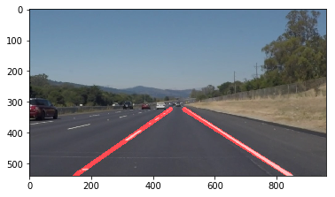
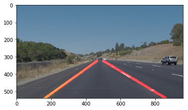 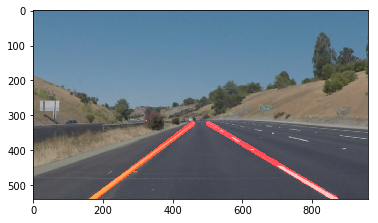
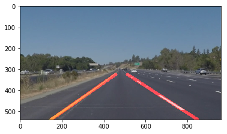 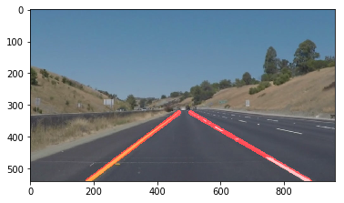

1. [Final Video - solidWhiteRight (YouTube)](https://youtu.be/q77C460FXCs)
2. [Final Video - solidYellowLeft (YouTube)](https://youtu.be/KwJKFVvGKU8)
3. [Final Video - challenge (YouTube)](https://youtu.be/Bt2AmrS9bXo)

---
# Reflection

The pipeline has been described above. Now, I will discuss potential 
shortcomings of the current pipeline and possible improvements.

## Potential Shortcomings of Current Pipeline

The pipeline works quite well with the sample images provided. However, 
there are still some issues with the videos - most importantly with the
Challenge Video.

1. The final lane markings are a bit jittery as the video plays. The lane
finding is done on each image frame separately and the slope varies a
little bit. The transition is not as smooth as I would like. This effect is
exaggerated in the Challenge video.

2. Initially, the Challenge video had a lot of errors. For example, the 
bridge marking was causing the right lane marker to shift. This was
taken care of by making the modified Draw_Lines function stricter in terms
of discarding any lines whose slope is less than 0.4. The final Challenge video performs
quite reasonably well except for some issues with the left yellow marker
shifting due to the shadows caused by the tree (image below).

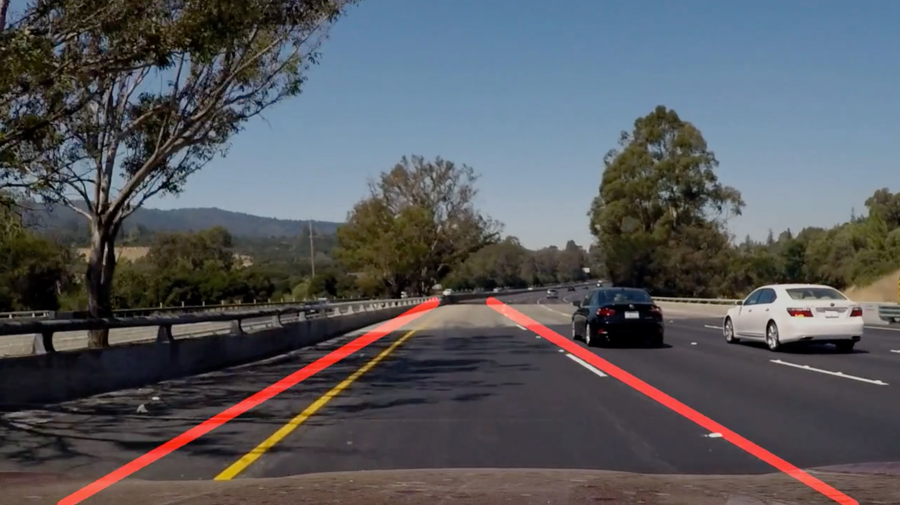

## Possible Improvements to Current Pipeline

1. Reduce the lane market jitter in the video sequence by persisting the slope
of the lanes from the previous frame to the next frame. Maybe average
the slope of the previous frame and the current frame to get to the 
final lane marker.

2. Make the pipeline more resilient to natural elements such as tree shadows
and lighter road areas with better image processing.
