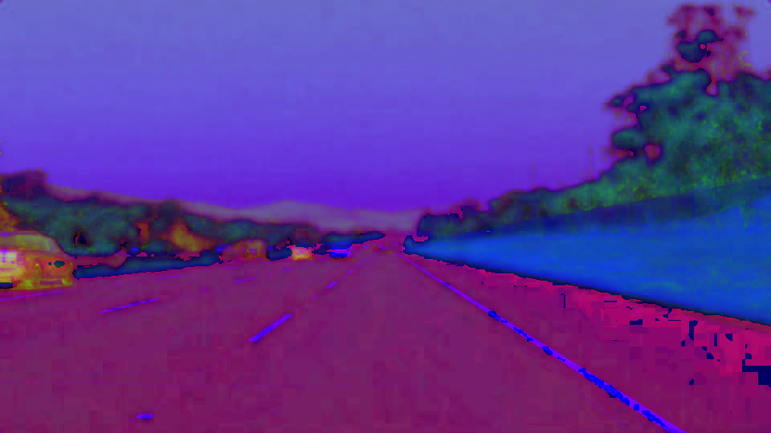

# **Finding Lane Lines on the Road**

---
# Introduction

The purpose of this project was to develop a lane finding pipeline and apply it 
to a series of images (shown below) as well as to three video streams (two normal and
one challenge video). The report below explains my pipeline as well as reflections about issues I faced
as well as possible improvement suggestions.

 
 
 

---

# Pipeline

My pipeline consisted of the following steps:

1. Color Selection of Yellow and White Lanes 
2. Combining the above Color Selection Mask and GrayScale Image to form a Boosted Image
3. Gaussian Blur
4. Canny Edge Detection
5. Region of Interest Selection
6. Hough Transform
7. Improved DrawLines

These steps are described in detail below.
---

## Step 1 - Color Selection of Yellow and White Lane Markers

The first step consisted of identifying yellow and white lane markers by processing in the color
space. To do this, I experimented with three color spaces.

### RGB Color Space

The following are the color selection bitmaps for the RGB color space. White color is relatively easy to segment in the RGB domain (e.g. values in range [190,190,190] to [255,255,255]). Yellow is harder in the RGB space (Pure yellow in the RGB space is [255,255,0]). As shown below, white works well, but yellow does not. Also as the RGB color space is additive and does not separate luminance and chrominance, there could be issues as it gets darker. So we explore alternate color spaces.

 
 
 

### HLS Color Space

HSL stands for _hue_, _saturation_ and _luminosity_. More details on HLS and HSV color spaces are here at [Wikipedia](https://en.wikipedia.org/wiki/HSL_and_HSV)

As shown below, both yellow and white lines are clearly visible in the HLS color space.

 
 
 

### HSV Color Space

HSV stands for _hue_, _saturation_ and _value_. Same link as above.

Unlike HSL color space, while yellow is clearly visible, white lines are not as sharp in HSV color space. So between HSL and HSV color space, we select HSL color space to filter yellow shades.  

 
 
 

### HLS Color Selection Bitmaps

Here we use color selection in the HLS color space. For yellow color, we restrict Hue to be in the range 10-40. There is no effect on luminance and we use Saturation between 100 and 255 to not deal with darker shades. For white, we make sure that luminance is high (between 200 and 255) while hue and saturation have no effect.
 
 Compared to RGB color space, HLS does a much better job selecting yellow colors.  We stick to HLS color space going forward.
 
 
 
 

At this point we end up with the color masks shown above.
---

## Writeup Template

### You can use this file as a template for your writeup if you want to submit it as a markdown file. But feel free to use some other method and submit a pdf if you prefer.

---

**Finding Lane Lines on the Road**

The goals / steps of this project are the following:
* Make a pipeline that finds lane lines on the road
* Reflect on your work in a written report

---

### Reflection

### 1. Describe your pipeline. As part of the description, explain how you modified the draw_lines() function.

My pipeline consisted of 5 steps. First, I converted the images to grayscale, then I ....

In order to draw a single line on the left and right lanes, I modified the draw_lines() function by ...

If you'd like to include images to show how the pipeline works, here is how to include an image:

![alt text][image1]

### 2. Identify potential shortcomings with your current pipeline

One potential shortcoming would be what would happen when ...

Another shortcoming could be ...

### 3. Suggest possible improvements to your pipeline

A possible improvement would be to ...

Another potential improvement could be to ...
